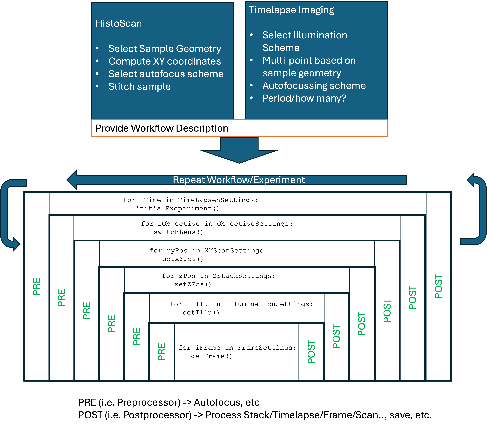

# ImSwitchWorkflowManager
Experimental Workflow Manager for Most Microscopy Experiments

This is a general-puprose workflow designer and egine for simple experiments using microscopes in imswitch. 

Inspired by https://nic.ucsd.edu/services/jobs.html
A (probably) very similar interface as I'Ve learned: https://pymmcore-plus.github.io/pymmcore-plus/guides/event_driven_acquisition/
